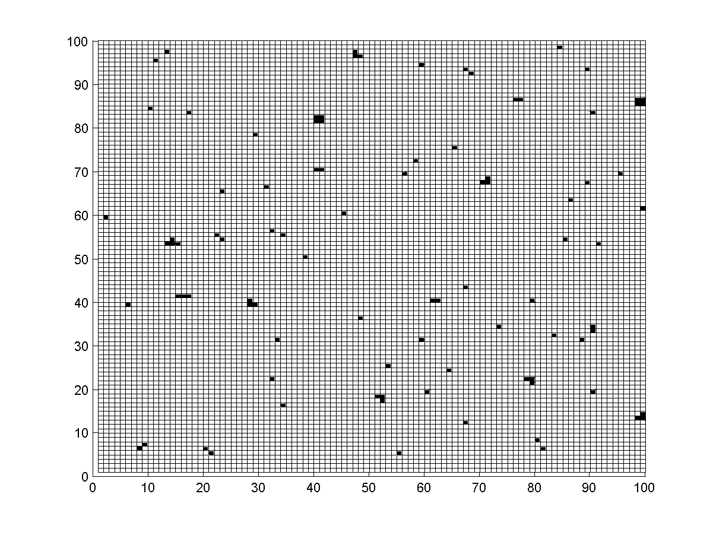
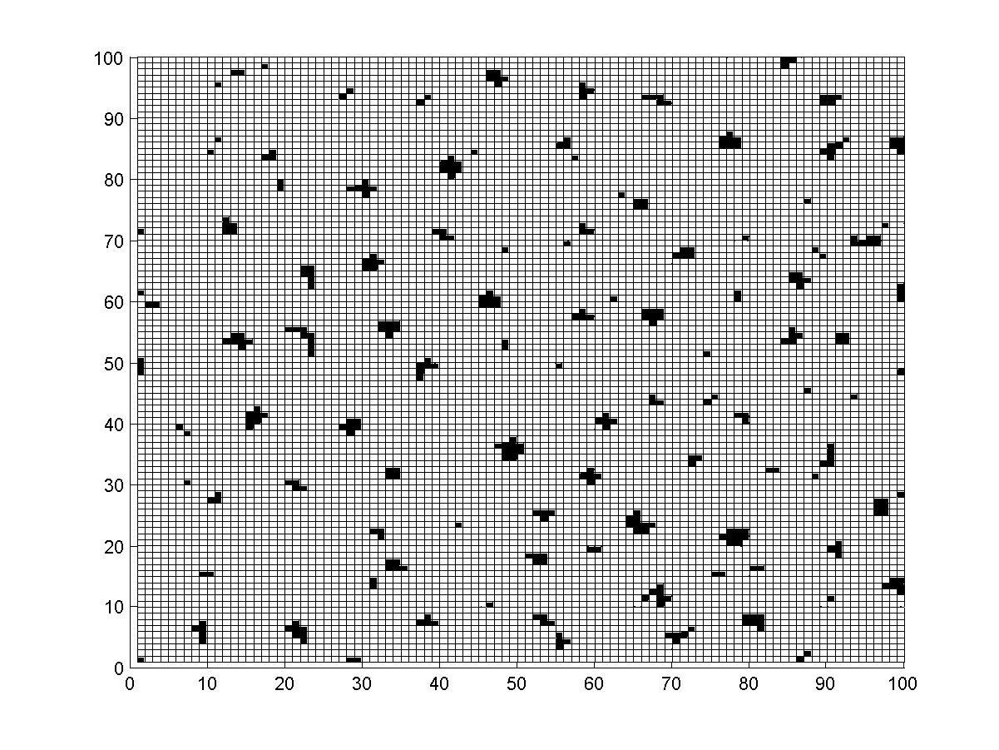
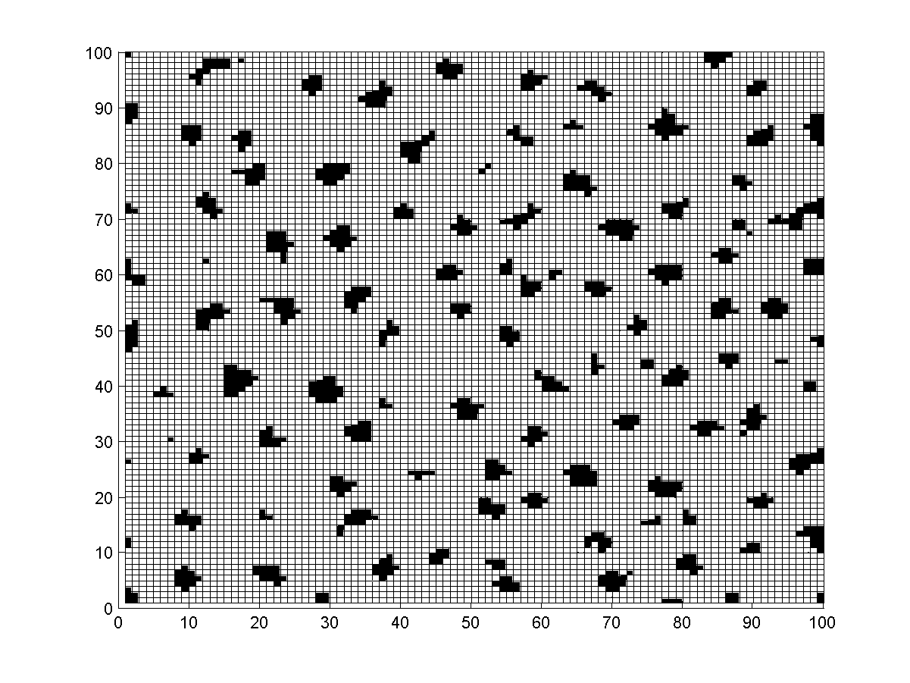
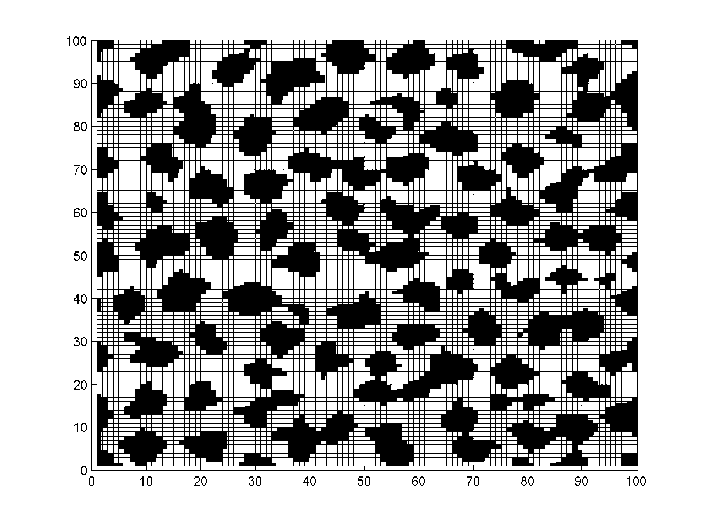
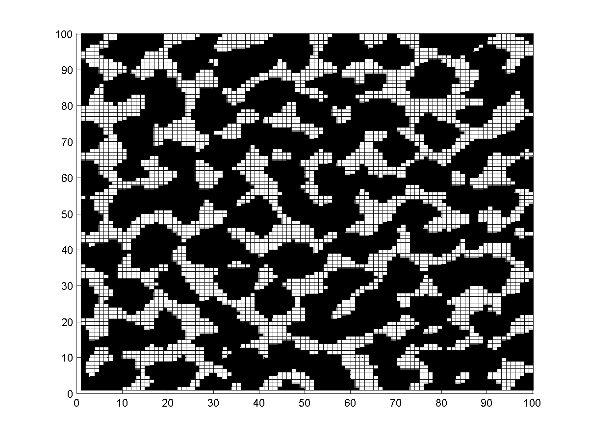

# KineticMonteCarlo-FilmGrowth
A MATLAB program for simulating film growth using Kinetic Monte Carlo.

A simple Monte Carlo simulation of monolayer film growth written in Matlab (2010b tested)

Based on Metropolis–Hastings, a Markov chain Monte Carlo (MCMC) method.

A 2-D potential field (Morse Potential) is assumed on the surface.

Might be kind of limited, because this is only part of a college coursework.

Useful information available in the report (https://github.com/SequoiaDu/KineticMonteCarlo-FilmGrowth/blob/master/DuJS_report.pdf), section 4 (in Chinese).

## Example results
### 100 steps

### 400 steps

### 1000 steps

### 4000 steps

### 7000 steps

